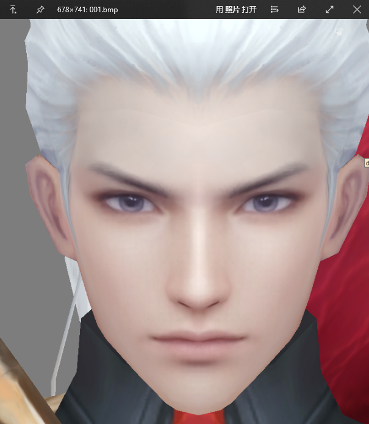
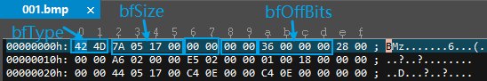
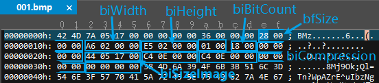

# BMP图像处理

本篇博客记录完成《数字媒体内容综合设计与实验》的图像处理实验的学习过程。要求实现一个显示bmp文件的程序（语言不限），并实现图像亮度、对比度调整，图像平移、放大、旋转和镜像。

> 参考：
>
> https://blog.csdn.net/lanbing510/article/details/8176231
>
> 

## BMP文件格式

### 1. 位图文件头(bmp file header) - 14字节

| 字段          | 字节数 | 说明                                                         |
| ------------- | ------ | ------------------------------------------------------------ |
| `bfType`      | 2      | 文件类型 BMP文件这两个字节为0x4d42，对应字符'BM'          |
| `bfSize`      | 4      | 文件大小                                                     |
| `bfReserved1` | 2      | 保留字段，必须设为0                                          |
| `bfReserved2` | 2      | 保留字段，必须设为0                                          |
| `bfOffBits`   | 4      | 从文件头到位图数据的偏移量，即： 偏移量=文件头+信息头+调色板长度 |

用UltraEdit打开图片001.bmp（24位真彩色bmp图）：

注意读取字节反向

| 字段        | 值                                | 说明                            |
| ----------- | --------------------------------- | ------------------------------- |
| `bfType`    | 0x4D42                            | BM                              |
| `bfSize`    | 0x0017057A = 1508730字节 = 1.43MB | 等同于右键图片属性中显示的大小  |
| `bfOffBits` | 0x00000036 = 54字节               | = 文件头14 + 信息头40 + 调色板0 |

### 2. 位图信息头(bitmap information) - 40字节

| 字段              | 字节数 | 说明                                                         |
| ----------------- | ------ | ------------------------------------------------------------ |
| `biSize`          | 4      | 信息头的大小 BMP文件为0x28，即40字节                      |
| `biWidth`         | 4      | 图像的宽，单位是像素                                         |
| `biHeight`        | 4      | 图像的高，单位是像素                                         |
| `biPlanes`        | 2      | 颜色平面数，总设为1                                          |
| `biBitCount`      | 2      | 每像素比特数，=比特数/像素数 即每个像素用多少位表示       |
| `biCompression`   | 4      | 图像的压缩类型 最常用的是0，即BI_RGB格式，表示不压缩      |
| `biSizeImage`     | 4      | 位图数据的大小 图像大小=文件大小bfSize-偏移量bfOffBits BI_RGB格式时，可设置为0 |
| `biXPelsPerMeter` | 4      | 水平分辨率，单位是像素/米，有符号整数                        |
| `biYPelsPerMeter` | 4      | 垂直分辨率，单位是像素/米，有符号整数                        |
| `biClrUsed`       | 4      | 位图使用的调色板中的颜色索引数 0表示使用所有的调色板选项  |
| `biClrImportant`  | 4      | 对图像显示有重要影响的颜色索引数目 0表示所有都重要        |

| 字段            | 值                       | 说明              |
| --------------- | ------------------------ | ----------------- |
| `biSize`        | 0x00000028 = 40字节      | BMP文件信息头大小 |
| `biWidth`       | 0x000002A6 = 678像素     | 图片宽678像素     |
| `biHeight`      | 0x000002E5 = 741像素     | 图片高741像素     |
| `biBitCount`    | 0x0018 = 24位            | 24位真彩色图片    |
| `biCompression` | 0x00000000               | 不压缩            |
| `biSizeImage`   | 0x00170544 = 1508676字节 | =bfOffbits-54     |

理论上，biSizeImage = biWidth\*biHeight\*biBitCount/8，由于Windows行扫描的最小单位为4字节，所以此处biWidth应向上取4的倍数。

但是从上面这张图来看，biSizeImage = 1508686字节，确实等于bfOffbits-54，但是不等于680\*741\*24/8 =1511640字节，也不等于678\*741\*24/8 =1507194字节，不解？？？

### 3. 调色板(color palette) - 可选项

详见https://blog.csdn.net/lanbing510/article/details/8176231

采用24位真彩色位图，无需使用调色板模块。用3个字节（24位）的实际RGB值表示一个像素。

同理，32位真彩色位图也不需要调色板模块。用4个字节（32位）的RGBA值表示一个像素。

### 4. 位图数据(bitmap data)

未完待续。。。