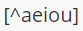
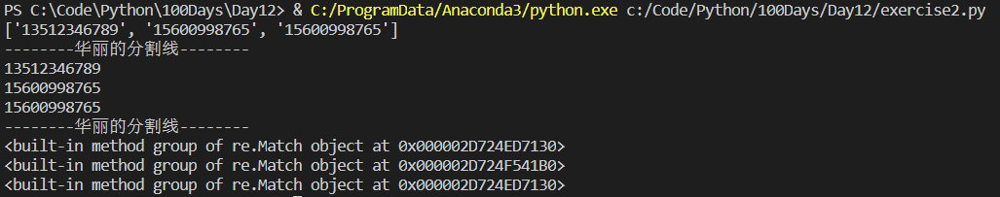

# Python-Day12-正则表达式

> 参考：
>
> [正则表达式30分钟入门教程]: https://deerchao.cn/tutorials/regex/regex.htm
> [Python - 100天从新手到大师]: https://github.com/jackfrued/Python-100-Days

## 1、笔记

- 精确查找 hi 这个单词，使用 `\bhi\b`
- 确保整个字符串就是5-12位数字，而不是字符串中包含 5-12连续位数字，使用 `^\d{5,12}$`
- 使用分支条件时，注意各个条件的顺序。因为匹配分枝条件时，将会从左到右地测试每个条件，如果满足了某个分枝的话，就不会去再管其它的条件了。
  -  `\d{5}-\d{4}|\d{5}`这个表达式用于匹配美国的邮政编码（5位数字，或者用连字号间隔的9位数字）
  - `\d{5}|\d{5}-\d{4}`这个表达式就只会匹配5位的邮编(以及9位邮编的前5位)
- 同时使用两种断言`(?<=\s)\d+(?=\s)`匹配以空白符间隔的数字(提醒：不包括这些空白符)
- 反义总要匹配一个字符：
  - `\b\w*q[^u]\w*\b`本意是匹配包含后面不是字母u的字母q的单词,，但无法匹配q在结尾的情况。因为`[^u]`总要匹配一个字符，所以对于Iraq这个词，`[^u]`就匹配了\b，导致\w*\b匹配下一个单词，因此可能会匹配成整个 Iraq fighting
  - 解决办法：`\b\w*q(?!u)\w*\b`
- 正则表达式最早开始的匹配拥有最高的优先权，其次是贪婪匹配
  - 对字符串 aabab，`a.*b`匹配aabab（贪婪匹配）
  - 对字符串 aabab，`a.*?b`匹配aab（最早开始的匹配，懒惰匹配）和ab（懒惰匹配）

## 2、正则表达式归纳

[正则表达式在线测试工具]: https://deerchao.cn/tools/wegester/

### 2.1 常用元字符 & 反义

| 语法 | 含义                                       | 示例       | 说明                                                |
| ---- | ------------------------------------------ | ---------- | --------------------------------------------------- |
|      | **元字符**                                 |            |                                                     |
| `.`  | 匹配除换行符以外的任意字符                 | b.t        | 可以匹配bat / but / b#t / b1t等                     |
| `\w` | 匹配字母/数字/下划线/汉字                  | b\wt       | 可以匹配bat / b1t / b_t / b汉t等<br/>但不能匹配b#t  |
| `\s` | 匹配任意的空白字符（包括\r、\n、\t等）     | love\s\you | 可以匹配love you                                    |
| `\d` | 匹配数字                                   | \d\d       | 可以匹配01 / 23 / 99等                              |
| `\b` | 匹配单词的边界（开始或结束）               | \bThe\b    | 匹配The apple中的The                                |
| `^`  | 匹配字符串的开始                           | ^The       | 可以匹配The开头的字符串                             |
| `$`  | 匹配字符串的结束                           | .exe$      | 可以匹配.exe结尾的字符串                            |
|      | **反义**                                   |            | **反义总要匹配一个字符**                            |
| `\W` | 匹配任意非字母/数字/下划线/汉字的字符      | b\Wt       | 匹配b#t / b@t等<br/>不能匹配but / b1t / b_t/ b汉t等 |
| `\S` | 匹配非空白字符                             | love\Syou  | 匹配love#you等<br/>但不能匹配love you               |
| `\D` | 匹配非数字                                 | \d\D       | 匹配9a / 3# / 0F等                                  |
| `\B` | 匹配非单词边界（不是单词开头或结束的位置） | \Bio\B     | 匹配lion中的io                                      |

- 若查找元字符本身，使用字符转义符`\`，eg. `\\`, `\*`, `\.`, `\(`, `\)`
- 精确查找 hi 这个单词，使用 `\bhi\b`
- 确保整个字符串就是5-12位数字，而不是字符串中包含 5-12连续位数字，使用 `^\d{5,12}$`

### 2.2 重复限定符 & 懒惰限定符

| 语法     | 含义                          | 示例             | 说明                                   |
| -------- | ----------------------------- | ---------------- | -------------------------------------- |
|          | **重复限定符**                |                  |                                        |
| `*`      | 匹配0次或多次                 | \w*              |                                        |
| `+`      | 匹配1次或多次                 | \w+              |                                        |
| `?`      | 匹配0次或1次                  | \w?              |                                        |
| `{n}`    | 匹配n次                       | \w{5}            | 可以匹配 enhhh / 你是个憨批 等         |
| `{n,}`   | 匹配至少n次                   | \w{3,}           |                                        |
| `{n,m}`  | 匹配至少n次至多m次            | \w{3,6}          | 匹配3-6位连续的字母/数字/下划线/汉字   |
|          | **懒惰限定符**                |                  |                                        |
| `*?`     | 重复任意次，但尽可能少重复    | a.\*b<br/>a.\*?b | 匹配aabab的aabab<br>匹配aabab的aab和ab |
| `+?`     | 重复1次或多次，但尽可能少重复 |                  |                                        |
| `??`     | 重复0次或1次，但尽可能少重复  |                  |                                        |
| `{n,}?`  | 重复n次以上，但尽可能少重复   |                  |                                        |
| `{n,m}?` | 重复n到m次，但尽可能少重复    |                  |                                        |

正则表达式最早开始的匹配拥有最高的优先权，其次是贪婪匹配

- 对字符串 aabab，`a.*b`匹配aabab（贪婪匹配）
- 对字符串 aabab，`a.*?b`匹配aab（最早开始的匹配，懒惰匹配）和ab（懒惰匹配）

### 2.3 字符类

| 语法  | 含义                           | 示例                                          | 说明                                            |
| ----- | ------------------------------ | --------------------------------------------- | ----------------------------------------------- |
| `[]`  | 匹配来自字符集的任意单一字符   | [aeiou]<br>[a-z0-9A-Z]                        | 匹配任一元音字母字符<br>匹配一个大小写字母/数字 |
| `[^]` | 匹配不在字符集中的任意单一字符 |  | 匹配任一非元音字母字符                          |

### 2.4 分支

| 语法                                                      | 含义 | 示例                                                    | 说明               |
| --------------------------------------------------------- | ---- | ------------------------------------------------------- | ------------------ |
|  | 分支 |  | 可以匹配foo或者bar |

- 使用分支条件时，注意各个条件的顺序。因为匹配分枝条件时，将会从左到右地测试每个条件，如果满足了某个分枝的话，就不会去再管其它的条件了。
  -  `\d{5}-\d{4}|\d{5}`这个表达式用于匹配美国的邮政编码（5位数字，或者用连字号间隔的9位数字）
  -  `\d{5}|\d{5}-\d{4}`这个表达式就只会匹配5位的邮编(以及9位邮编的前5位)

### 2.5 分组/后向引用/断言/注释

- 分组0对应整个正则表达式，`\1`代表分组1匹配的文本

| 语法             | 含义                                                         | 示例                          | 说明                                                         |
| ---------------- | ------------------------------------------------------------ | ----------------------------- | ------------------------------------------------------------ |
| **捕获**         |                                                              |                               |                                                              |
| `(exp)`          | 匹配exp，并捕获文本到自动命名的组里                          | \b(\w+)\b\s+\1\b              | 可以匹配go go / kitty kitty等重复单词<br/>`\1`代表分组1匹配的文本 |
| `(?<name>exp)`   | 匹配exp，并捕获文本到名为name的组中，也可以写成`(?'name'exp)` | \b(?<Word>\w+)\b\s+\k<Word>\b | 匹配内容同上<br/>`\k<Word>`用来反向引用分组捕获内容          |
| `(?:exp)`        | 匹配exp，但是不捕获匹配的文本，也不给此分组分配编号          |                               |                                                              |
| **零宽断言**     |                                                              |                               |                                                              |
| `(?=exp)`        | 匹配exp前面的位置                                            | \\b\\w+(?=ing)                | 可以匹配I'm dancing中的danc                                  |
| `(?<=exp)`       | 匹配exp后面的位置                                            | (?<=\\bdanc)\\w+\\b           | 可以匹配I love dancing and reading中的第一个ing              |
| **负向零宽断言** |                                                              |                               |                                                              |
| `(?!exp)`        | 匹配后面跟的不是exp的位置                                    |                               |                                                              |
| `(?<!exp)`       | 匹配前面不是exp的位置                                        |                               |                                                              |
| **注释**         |                                                              |                               |                                                              |
| `(?#comment)`    | 注释，这种类型的分组不对正则表达式的处理产生任何影响，用于提供注释让人阅读 |                               |                                                              |

- 同时使用两种零宽断言`(?<=\s)\d+(?=\s)`匹配以空白符间隔的数字(**提醒：不包括这些空白符**)
- 负向零宽断言用于确保某个字符没有出现，但不想去匹配它
  - `\b\w*q[^u]\w*\b`本意是匹配包含后面不是字母u的字母q的单词,，但无法匹配q在结尾的情况。因为`[^u]`总要匹配一个字符，所以对于Iraq这个词，`[^u]`就匹配了\b，导致\w*\b匹配下一个单词，因此可能会匹配成整个 Iraq fighting
  - 解决办法：负向零宽断言`\b\w*q(?!u)\w*\b`
- 注释`(?#comment)`：`2[0-4]\d(?#200-249)|25[0-5](?#250-255)|[01]?\d\d?(?#0-199)`表示IP地址中的一个数字，不能大于255

## 3、Python对正则表达式的支持

Python提供了re模块来支持正则表达式相关操作。re模块的核心函数如下表所示：

| 函数                                           | 说明                                                         |
| ---------------------------------------------- | ------------------------------------------------------------ |
| `compile(pattern, flags=0)`                    | 编译正则表达式返回正则表达式对象                             |
| `match(pattern, string, flags=0)`              | 用正则表达式匹配字符串 成功返回匹配对象 否则返回None         |
| `search(pattern, string, flags=0)`             | 搜索字符串中第一次出现正则表达式的模式 成功返回匹配对象 否则返回None |
| `split(pattern, string, maxsplit=0, flags=0)`  | 用正则表达式指定的模式分隔符拆分字符串 返回列表              |
| `sub(pattern, repl, string, count=0, flags=0)` | 用指定的字符串替换原字符串中与正则表达式匹配的模式 可以用count指定替换的次数 |
| `fullmatch(pattern, string, flags=0)`          | match函数的完全匹配（从字符串开头到结尾）版本                |
| `findall(pattern, string, flags=0)`            | 查找字符串所有与正则表达式匹配的模式 返回字符串的列表        |
| `finditer(pattern, string, flags=0)`           | 查找字符串所有与正则表达式匹配的模式 返回一个迭代器          |
| `purge()`                                      | 清除隐式编译的正则表达式的缓存                               |
| `re.I / re.IGNORECASE`                         | 忽略大小写匹配标记（用于flags赋值）                          |
| `re.M / re.MULTILINE`                          | 多行匹配标记（用于flags赋值）                                |

- re模块的正则表达式相关函数中都有一个**flags**参数，它代表了正则表达式的匹配标记，可以通过该标记来指定匹配时是否忽略大小写、是否进行多行匹配、是否显示调试信息等。如果需要为flags参数指定多个值，可以使用[按位或运算符](http://www.runoob.com/python/python-operators.html#ysf5)进行叠加，如`flags=re.I | re.M`。
- `re.match(pattern, string, flags=0)`，匹配

```python
"""
验证输入用户名和QQ号是否有效并给出对应的提示信息

要求：
- 用户名必须由字母、数字或下划线构成且长度在6~20个字符之间
- QQ号是5~12的数字且首位不能为0
"""

import re

def main():
    username = input('请输入用户名：')
    qq = input('请输入QQ号：')

    # match函数的第一个参数是正则表达式字符串或正则表达式对象
    # 第二个参数是要跟正则表达式做匹配的字符串对象
    m1 = re.match(r'^[0-9a-zA-Z_]{6,20}$', username)
    if not m1:
        print('请输入有效的用户名！')
    
    m2 = re.match(r'^[1-9]\d{4,11}$', qq)   # 字符串前加上r表示原始字符串，即字符串中每个字符都有原始意义，不含转义字符。否则\d要写成\\d
    if not m2:
        print('请输入有效的QQ号！')

    if m1 and m2:
        print('你输入的信息是有效的！')

if __name__ == '__main__':
    main()
```

- `re.compile(pattern, flags=0)`，编译正则表达式，并创建正则表达式对象
- `re.findall(pattern, string, flags=0)`, 返回列表
- `pattern.finditer(pattern, string, flags=0)`，返回迭代器
- `pattern.search(pattern, string, flags=0)`

```python
"""
从一段文字中提取出国内手机号码

电信：133/153/180/181/189/177
联通：130/131/132/155/156/185/186/145/176
移动：134/135/136/137/138/139/150/151/152/157/158/159/182/183/184/187/188/147/178
即130-139, 145, 147, 150-153, 155-159, 176-178, 180-189
"""

import re

def main():
    # re.compile(pattern, flags=0)，编译正则表达式，并创建正则表达式对象
    # 使用了前瞻断言(?<=\D)和回顾断言(?=\D)来保证手机号前后不应该出现数字
    # 也可以使用前瞻和回顾负向断言：(?<!\d)和(?!\d)
    pattern = re.compile(r'(?<=\D)(1[38]\d{9}|14[57]\d{8}|15[0-35-9]\d{8}|17[6-8]\d{8})(?=\D)')

    sentence = '''
    重要的事情说8130123456789遍，我的手机号是13512346789这个靓号，
    不是15600998765，也不是110或119，王大锤的手机号才是15600998765
    '''

    # re.findall(pattern, string, flags=0), 返回列表
    # 查找所有匹配，并保存到一个列表中
    mylist = re.findall(pattern, sentence)
    print(mylist)
    print('--------华丽的分割线--------')

    # pattern.finditer(pattern, string, flags=0)，返回迭代器
    # 通过迭代器取出匹配对象，并获得匹配的内容
    for temp in pattern.finditer(sentence):
        print(temp.group())
    print('--------华丽的分割线--------')

    # pattern.search(pattern, string, flags=0)
    # 通过search函数指定搜索位置，找出所有匹配项
    m = pattern.search(sentence)
    while m:
        print(m.group)
        m = pattern.search(sentence, m.end())


if __name__ == '__main__':
    main()
```



- `re.sub(pattern, repl, string, count=0, flags=0)`，替换

```python
"""
替换字符串中的不良内容
"""

import re

def main():
    sentence = '你丫是傻叉吗? 我操你大爷的. Fuck you.'
    purified = re.sub('[操肏艹]|fuck|shit|傻[比屄逼叉缺吊屌]|煞笔',
                      '*', sentence, flags=re.IGNORECASE)
    print(purified) # 你丫是*吗? 我*你大爷的. * you.


if __name__ == '__main__':
    main()
```

- `re.split(pattern, string, maxsplit=0, flags=0)`，字符串切割

```python
"""
拆分长字符串
"""

import re

def main():
    poem = '床前明月光，疑是地上霜。举头望明月，低头思故乡。'
    
    sentence_list = re.split(r'[，。,.]', poem)
    while '' in sentence_list:
        sentence_list.remove('')
    print(sentence_list)
    # ['床前明月光', '疑是地上霜', '举头望明月', '低头思故乡']


if __name__ == '__main__':
    main()
```

