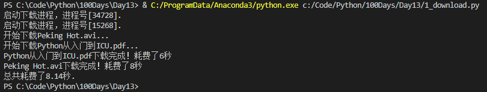

# Python-Day13-进程和线程

> 参考：
>
> [Python - 100天从新手到大师]: https://github.com/jackfrued/Python-100-Days

## 1、笔记


## 2、Python中的多进程

### 2.1 进程的创建、启动和执行

在Windows中没有`fork()`调用，可以使用`multiprocessing`模块的`Process`类来创建进程。

```Python
"""多进程示例"""
from multiprocessing import Process
from os import getpid
from random import randint
from time import time, sleep

# 进程启动后要执行的代码
def download_task(filename):
    print('启动下载进程，进程号[%d].' % getpid())   # 获取进程号
    print('开始下载%s...' % filename)
    time_to_download = randint(5, 10)
    sleep(time_to_download)
    print('%s下载完成！耗费了%d秒' % (filename, time_to_download))


def main():
    start = time()

    # 进程1，使用multiprocessing模块的Process类来创建子进程
    # 参数target传入一个函数来表示进程启动后要执行的代码，args代表传递给target函数的参数
    p1 = Process(target=download_task, args=('Python从入门到ICU.pdf', ))
    p1.start()	# 启动进程

    # 进程2
    p2 = Process(target=download_task, args=('Peking Hot.avi', ))
    p2.start()

    p1.join()	# 等待进程执行结束
    p2.join()

    end = time()
    print('总共耗费了%.2f秒.' % (end - start))


if __name__ == '__main__':
    main()
```



### 2.2 进程间通信

使用`multiprocessing`模块的`Queue`类（底层通过管道和信号量实现）

## 3、Python中的多线程

