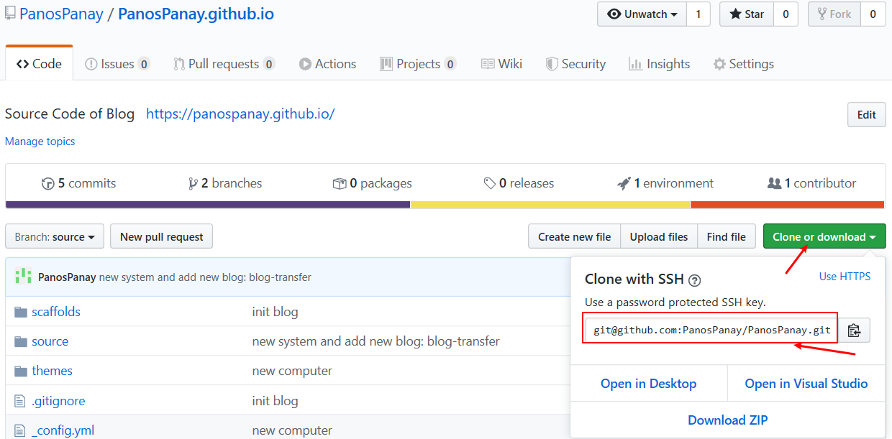

# hexo博客迁移（换电脑继续更新博客）

更换电脑/重装系统后的操作：

- 安装Git（廖雪峰的Git教程https://www.liaoxuefeng.com/wiki/896043488029600）

- 安装完Git后，Git Bash输入如下指令设置信息

  ```shell
  $ git config --global user.name "Your Name"	# 替换成自己的名字
  $ git config --global user.email "email@example.com"	# 替换成自己的邮箱地址
  ```

- 设置 SSH 密钥。使用如下命令生成SSH密钥

  ```shell
  $ ssh-keygen
  ```

- 输入以上命令后，一路按enter键采用默认值

- 输入如下命令查看并复制SSH密钥

  ```shell
  $ cat ~/.ssh/id_rsa.pub
  ```

  复制SSH密钥，格式如下：

  ```
  ssh-rsa ...
  ```

- 到GitHub的SSH设置页面（导航栏头像 - Settings - SSH and GPG keys)，点击New SSH key按钮，将复制的内容粘贴到Key输入框中，再填写标题，eg."My New PC"，最后点击“Add SHH key"按钮保存

- 克隆。

  在本地新建博客文件夹，比如"D:\Blog"

  在该文件夹下Git Bash Here，使用如下命令拷贝博客的GitHub仓库到本地（默认分支为source）

  ```shell
  $ git clone git@github.com:PanosPanay/PanosPanay.github.io.git
  # clone后面的一串可以通过点击GitHub博客仓库的Clone or download复制得到
  ```

  

- 安装Node.js

  下载地址：https://nodejs.org/zh-cn/download/

  按照提示安装即可。

  正常安装完成后，环境变量就已经被配置好了，能正常使用 `npm` 命令。

  输入如下命令分别出现对应的版本号即代表安装成功

  ```shell
  $ node -v
  $ npm -v
  ```

- 如果成功执行上述步骤后，在执行下述步骤中的`hexo`命令，遇到报错`bash: hexo: command not found`，则需要配置环境变量。参考https://blog.csdn.net/qq_36759224/article/details/100411949

- 在本地新拷贝的`D:\Blog\PanosPanay.github.io`文件夹下，Git Bash Here，分别输入如下命令(参考：https://www.zhihu.com/question/21193762)

  ```shell
  $ npm install hexo
  $ npm install
  $ npm install hexo-deployer-git
  ```

- 将原来电脑上博客文件夹下的如下文件复制粘贴到当前博客文件夹（主题等配置）

  ```
   _config.yml
   package.json
   scaffolds/
   source/
   themes/
   deploy.sh
  ```

- 更新博客，增改博文

- 分别执行如下命令，将改动推送到Github

  ```shell
  $ git add .
  $ git commit -m "..."
  $ git push origin source # 之后可直接 git push
  ```

- 发布到master分支

  ```shell
  $ sh deploy.sh
  ```

