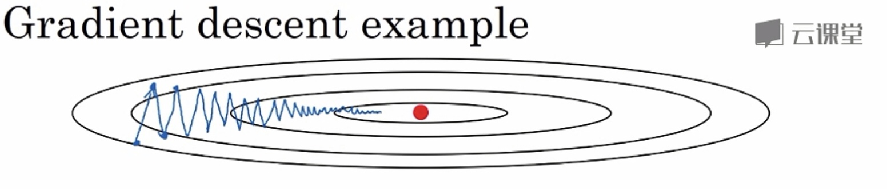

# C2W2 优化算法

# 吴恩达深度学习C2W2 优化算法

## 1、mini-batch 梯度下降法

- 如果训练集较小（小于2000个样本），则直接使用 batch 梯度下降法（即 mini-batch size = m）
- 如果训练样本数据较大，**mini-batch size 一般设为 64-512 ，设为 2 的 n 次方**，代码运行快一些。也有设为 1024 的，比较少见

使用 batch 梯度下降法，一次遍历训练集只能做一个梯度下降；使用 mini-batch 梯度下降法，一次遍历训练集（1 epoch），能做 n 个梯度下降（n 为划分的 mini-batch 数目）

## 2、优化算法（加速梯度下降）

### 2.1、指数加权平均

$$
v_t = \beta v_{t-1} + (1-\beta)\theta_t
$$

$$
若 \theta 代表当日气温， v_t 可视为过去\frac{1}{1-\beta} 天温度的指数加权平均
$$

占用极少内存（只占用一行代码，且计算指数加权平均数也只占用当行数字的存储，只需要把最新数据代入公式，不断覆盖就可以）

#### 偏差修正

当 β 值设的较大时（eg. 0,98)，初期估测值不准（过小），可以**用 $\frac{v_t}{1 - \beta^t}$ 代替 $v_t$ 来估测第 t 天的温度值。**

随着 t 的增大，$\beta^t$ 的值接近于 0 ，偏差修正几乎没有作用。

但如果你关心初始时期的偏差，在刚开始计算指数加权平均时，偏差修正能帮你在早期获取更好的估测。，**使得指数加权平均数的运算更加准确（特别是在估测初期）**。

### 2.2 （Momentum）动量梯度下降法

**基本思想**：**计算梯度的指数加权平均数**，并利用该梯度更新你的权重。

**目的**：加速梯度下降

```
On iteration t:
	# Compute dW,db on the current mini-batch
```

$$
v_{dw}, v_{db} 初始值为0，一般设 \beta = 0.9，\alpha需要调试
$$

$$
v_{dw} = \beta v_{dw} + (1 - \beta) dW
$$

$$
v_{db} = \beta v_{db} + (1 - \beta) db
$$

$$
W = W - \alpha v_{dW}, b = b - \alpha v_{db}
$$

有2个超参数，α 和 β。**β 的值常设为0.9**，这相当于平均了前10次迭代的梯度，而10次迭代后已过了初始阶段，所以不需要偏差修正。

**原理**：通过以上的公式计算加权平均，结合下面的图：

- 在纵轴（偏置b）方向，平均的过程中，正负相抵，所以接近于0，所以用指数加权平均数更新偏置b，在纵轴方向波动减小。
- 在横轴（权重W）方向，由于所有微分都指向横轴方向，所以平均值仍较大，所以用指数加权平均数更新权重W，在横轴方向依旧有更快的学习速度



### 2.3 RMSprop算法（均方根算法）

**目的**：加速梯度下降

RMSprop和Momentum有很相似的一点，可以消除梯度下降中的摆动，并允许你使用一个更大的学习率α，从而加快你的学习算法速度。

```
On iteration t:
	# Compute dW,db on the current mini-batch
```

$$
S_{dw}, S_{db} 初始值为0，一般设 \beta = 0.999，\alpha需要调试
$$

$$
S_{dW} = \beta S_{dW} + (1 - \beta) (dW)^2
$$

$$
S_{db} = \beta S_{db} + (1 - \beta) (db)^2
$$

$$
W:= W - \alpha \frac{dW}{\sqrt{S_{dW}}}, b := b -  \alpha \frac{db}{\sqrt{S_{db}}}
$$

**原理**：因为db较大，dW较小（可以从2.2的图看出纵轴的倾斜程度大，所以b的梯度db大）；所以$S_{db}$也较大，而$S_{dW}$则较小；所以相当于在更新时b的学习率较小，而W的学习率较大；这就达到了消除纵向摆动，加快横向更新速度的目的。

不过为了保证在更新参数时不会出现除以0的情况，最后一步的更新操作通常更改为：
$$
W:= W - \alpha \frac{dW}{\sqrt{S_{dW}} + \varepsilon}, b := b -  \alpha \frac{db}{\sqrt{S_{db}} + \varepsilon}
$$

### 2.4 Adam算法

**基本思想**：**结合 Momentum 和 RMSprop** 。

```
Adam optimization algorithm
```

0初始化：
$$
V_{dW} = 0, S_{dW} = 0, V_{db} = 0, S_{db} = 0
$$

```
On iteration t:
	# Compute dW,db on the current mini-batch
```

计算Momentum指数加权平均：
$$
v_{dw} = \beta_1 v_{dw} + (1 - \beta_1) dW,v_{db} = \beta_1 v_{db} + (1 - \beta_1) db
$$
RMSprop：
$$
S_{dW} = \beta_2 S_{dW} + (1 - \beta_2) (dW)^2,S_{db} = \beta_2 S_{db} + (1 - \beta_2) (db)^2
$$
偏差修正：
$$
v_{dW}^{corrected}\frac{v_{dW}}{1 - \beta_1^t}, v_{db}^{corrected}\frac{v_{db}}{1 - \beta_1^t}
$$

$$
S_{dW}^{corrected}\frac{S_{dW}}{1 - \beta_2^t},S_{db}^{corrected}\frac{S_{db}}{1 - \beta_2^t}
$$

更新权重：
$$
W := W - \alpha \frac{v_{dW}^{corrected}}{\sqrt{S_{dW}^{corrected}} + \varepsilon}, b := b - \alpha \frac{v_{db}^{corrected}}{\sqrt{S_{db}^{corrected}} + \varepsilon}
$$
以上就是Adam算法，**超参数缺省值**如下：
$$
\alpha 需要调试，\beta_1 = 0.9，\beta_2 = 0.999，\varepsilon = 10^{-8}
$$
一般直接使用这些超参数的缺省值，不需要修改。

### 2.5 学习率衰减

基本思想：学习率随时间慢慢减少。在学习初期学习率较大，即有较大的更新步伐；当开始收敛时，学习率较小，即更新步伐较小。

几种学习率衰减模式：

- $$
  \alpha = \frac{1}{1 + decay\_rate * epoch\_num} \alpha_0
  $$

  $$
  decay\_rate称为衰减率，epoch\_num为代数，\alpha_0为初始学习率
  $$

  $$
  decay\_rate和\alpha_0是两个需要调整的超参数
  $$

- 指数衰减：
  $$
  \alpha = 0.95^{epoch\_num} \alpha_0
  $$

- $$
  \alpha = \frac{k}{\sqrt{epoch\_num}} \alpha_0
  $$

  $$
  或者 \alpha = \frac{k}{\sqrt{t}} \alpha_0, t为mini-batch的序号
  $$