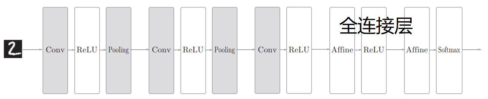
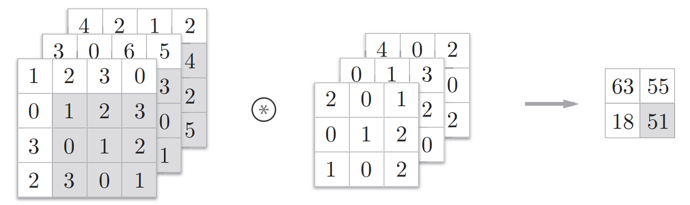
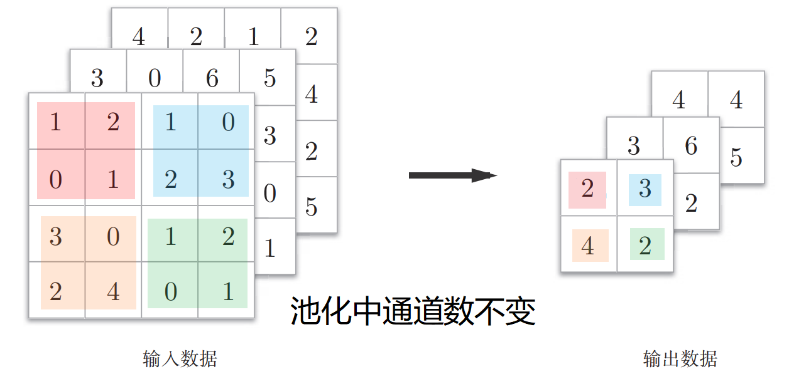

# 吴恩达深度学习 C4W1 卷积神经网络 CNN

CNN

- 卷积层
- 池化层
- 全连接层



## 卷积层

设第l层（layer l）是卷积层：
$$
输入的维度：n_H^{[l-1]} × n_W^{[l-1]} × n_c^{[l-1]}
$$

$$
f^{[l]} = filter size, 即过滤器大小（边长）
$$

$$
p^{[l]} = padding, 即填充
$$

$$
s^{[l]} = stride,即步幅
$$

$$
n_c^{[l]} = number of filters, 即过滤器个数
$$

则：
$$
每个filter的维度：f^{[l]}×f^{[l]}×n_c^{[l-1]}
$$

$$
权重weights，即所有filters的集合的维度：f^{[l]} × f^{[l]} × n_c^{[l-1]} × n_c^{[l]}
$$

$$
偏置bias维度：1 × 1 × 1 × n_c^{[l]}
$$

$$
输出，即激活值activations的维度：n_H^{[l]} × n_W^{[l]} × n_c^{[l]}
$$

每个filter的通道数：$n_c = 输入图像的通道数 = n_c^{[l-1]}$

每个filter，即权重的参数个数：$f^{[l]} × f^{[l]}$

filters的数目：$n_c^{[l]} = 检测的特征数量$

**输出图像的高度**：$n_H^{[l]} = ⌊\frac{n_H^{[l-1]} + 2p^{[l]} - f^{[l]}}{s^{[l]}} + 1⌋$

**输出图像的宽度**：$n_W^{[l]} = ⌊\frac{n_W^{[l-1]} + 2p^{[l]} - f^{[l]}}{s^{[l]}} + 1⌋$

**输出图像的通道数**：$n_c^{[l]} = l层的filters数目$

------

- kernel（核）/ **filter**（过滤器）

- 检测n个边缘特征，就设置n个filters，输出图片的通道数也等于n。

- padding卷积

  - Valid卷积：不填充
  - Same卷积：填充后输出和输入的大小一致
    - 即$\frac{n + 2p -f}{s} + 1 = n$

- 推荐只是用奇数的过滤器，即将f设为奇数

- 向下取整操作，意味着只有当filter完全包含在（填充完的）图像内部时，才进行相乘操作。

- 三维卷积

  - **filters的通道数必须和输入图像的通道数匹配**

  - 假设filter size=3，通道数=3，则每次，先取图片红色通道的9个数字，与filter第一通道的9个数相乘再相加；然后再分别取绿色通道、蓝色通道执行相同操作，再把这些数相加，得到输出值

    

  - 每个filter得到的输出图像通道数仍为1，与输入图像通道数无关。

  - 输出图像最终的通道数 = filters 个数

- 即使输入图片很大，CNN的参数却很少，可以避免过拟合。

- 卷积层2个主要优势：

  - 参数共享
  - 稀疏连接

## 池化层

- 池化层可以缩减模型大小，提高计算速度，同时提高所提取特征的鲁棒性

- 两种池化类型：

  - 最大池化：最常用
  - 平均池化：用于很深的神经网络

  **最常用的是最大池化**

- 池化有一组超参数（f，s等），但是没有需要学习的参数，所以一旦确定了f，s，它就是一个固定运算，梯度下降无需改变任何值。

  在计算神经网络有多少层时，通道只统计具有权重和参数的层。**而池化层没有权重和参数**，只有一些超参数，所以池化层和卷积层共同作为一层。

- **池化**是对输入图像$n_c$个通道中的每个通道，都单独执行池化计算。所以**输出通道与输入通道数相同**。

  

- 池化的超级参数包括filter size（f）和步幅（s）

  **常用的超参数设置为：f = 2, s = 2**，**其效果相当于高度和宽度减一半**

  也有 f = 3, s = 2的情况

- **最大池化很少用到超参数padding**，所以最常用的：**p = 0**

- **注**：虽然吴恩达在视频中说，same卷积，就是填充后，你的输出大小和输入大小一样。而tensorflow中，卷积和池化的padding处理相同，那么最大池化如果用了same padding，理论上输出的大小也不变，但实际并不是这样的。

  我建立了一个CNN，理所当然地认为最大池化的padding设为same后，输出的长宽不变，但是报错：

  ```
  tensorflow.python.framework.errors_impl.InvalidArgumentError: Input to reshape is a tensor with 819200 values, but the requested shape has 52428800 [Op:Reshape]
  ```

  报错出现在下面代码的最后一行。

  ```python
  print(inputs.shape)                     # (32, 80, 160, 1)
  x = self.conv1(inputs)                  # [batch_size, 80, 160, 32]
  print(x.shape)                          # (32, 80, 160, 32)
  x = self.pool1(x)                       # [batch_size, 80, 160, 32]
  print(x.shape)                          # (32, 40, 80, 32)
  x = self.conv2(x)                       # [batch_size, 80, 160, 64]
  print(x.shape)                          # (32, 40, 80, 64)
  x = self.pool2(x)                       # [batch_size, 80, 160, 64]
  print(x.shape)                          # (32, 20, 40, 64)
  x = self.conv3(x)                       # [batch_size, 80, 160, 128]
  print(x.shape)                          # (32, 20, 40, 128)
  x = self.pool3(x)                       # [batch_size, 80, 160, 128]
  print(x.shape)                          # (32, 10, 20, 128)
  x = self.flatten(x)                     # [batch_size, 80 * 160 * 128]
  ```

  print输出的是实际维度，上一行的注释则是我原本认为的维度。原来，即使在最大池化中padding选了same，输出维度也不是就等于输入维度，因为**SAME padding输入输出一致的前提是`strides = 1`**，而我设置的`strides = 2`。

  > The TensorFlow Convolution example gives an overview about the difference between SAME and VALID : 
  > For the SAME padding, the output height and width are computed as:
  >     out_height = ceil(float(in_height) / float(strides[1]))
  >     out_width = ceil(float(in_width) / float(strides[2]))
  > And
  >     For the VALID padding, the output height and width are computed as:
  >     out_height = ceil(float(in_height - filter_height + 1) / float(strides[1]))
  >     out_width = ceil(float(in_width - filter_width + 1) / float(strides[2]))

  可以发现，池化层设置如下时，输出的长宽仍然会减半。

  ```
  self.pool3 = tf.keras.layers.MaxPool2D(
  	pool_size=[2, 2],
      strides=2,
      padding='same'
  )
  ```

  因为$H_{OUT} = H_{IN} / strides = H_{IN} / 2$，相当于只是抵消了filter_size的影响，而不对strides起作用，所以输出的长宽依旧减半了。

  池化本身就是所建模型大小（降维的）！

  参考：https://www.zhihu.com/question/376747493

  ​			https://www.imooc.com/article/73051

- 若最大池化的输入：$n_H × n_W × n_c$，设 p = 0

  则，输出：$⌊\frac{n_H - f}{s} + 1⌋ × ⌊\frac{n_W - f}{s} + 1⌋ × n_c$

------

- **池化层没有参数，卷积层参数相对较少，许多参数都存在于神经网络的全连接层。**
- **尽量不要自己设置超参数，而是查看文献中别人使用了哪些超参数，选一个别人任务中效果很好的架构，那么它也有可能适用于你自己的应用程序。**

