# 用GitHub Pages和Hexo架搭建博客

> 参考了如下教程：
>
> [超全面！如何用 GitHub 从零开始搭建一个博客 ？]: https://url.cn/5xQgPFy
> [用 GitHub + Hexo 建立你的第一个博客]: https://url.cn/5iCNSb6

## 1、在GitHub上建立仓库

首先需要有GitHub账号

在GitHub新建一个仓库(Repository)，名称为 {username}.github.io ，注意这个名称必须是 github.io 结尾。比如我的GitHub用户名为 PanosPanay ，我就新建一个 PanosPanay.github.io 。

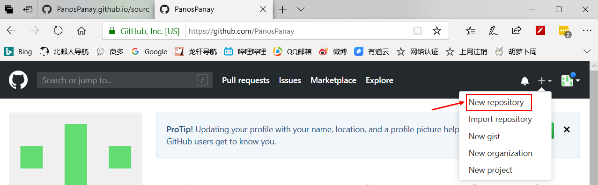

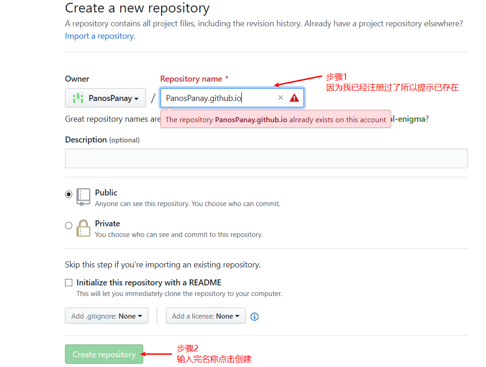

## 2、搭建环境

### 2.1 安装Node.js

下载地址：https://nodejs.org/zh-cn/download/

按照提示安装即可。

正常安装完成后，环境变量就已经被配置好了，能正常使用`npm`命令。可以在桌面按住Shift键，鼠标右键在此处打开PowerShell（命令行）窗口（或者cmd打开命令行；或者右键Git Bash Here打开命令行），依次输入如下命令，分别出现对应版本号代表安装成功。

```powershell
node -v
npm -v
```

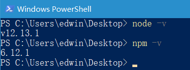

### 2.2 安装Hexo

打开命令行，输入如下命令回车，等待安装。

```powershell
cd /	# 返回C盘根目录，这一条命令是否使用看个人习惯，在这里可省略
npm install hexo-cli -g
```

安装过程中可能有一些WARN，可以不用管，之后的步骤能正常使用`hexo`即表示安装配置成功。

## 3、初始化博客/项目

这一步通过`Hexo`命令创建一个项目，并将其在本地跑起来。

首先，在任意位置新建一个文件夹，我在C盘新建了Blog文件夹。

然后，打开新建的文件夹(`C:\Blog`)，右键Git Bash Here；或者在此处打开PowerShell；或者在打开的命令行中通过cd指令定位到刚才新建的文件夹。

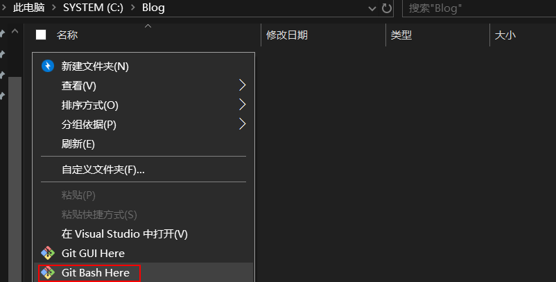

然后，使用如下命令创建项目：

```powershell
hexo init panospanay	# init之后跟的是项目名称，即要创建的博客名称
```

上述命令执行后会在`C:\Blog`文件夹中生成`panospanay`文件夹，且该文件夹下包含了`Hexo`的初始化文件。

然后，在命令行中通过cd指令转到`panospanay`文件夹（`cd C:\Blog\panospanay`）；或者打开`panospanay`文件夹后在此打开命令行/Git Bash Here，输入如下指令，将`Hexo`编译成HTML代码。

```powershell
hexo generate
```

然后，运行如下命令：

```
hexo server
```

运行以上命令后，命令行出现如下提示：

```powershell
INFO  Start processing
INFO  Hexo is running at http://localhost:4000 . Press Ctrl+C to stop.
```

此时，打开浏览器，输入地址 http://localhost:4000 ，就可以看到最原始的博客。我我当时没有截图，从参考的教程中截了一张图，大概是这样的：

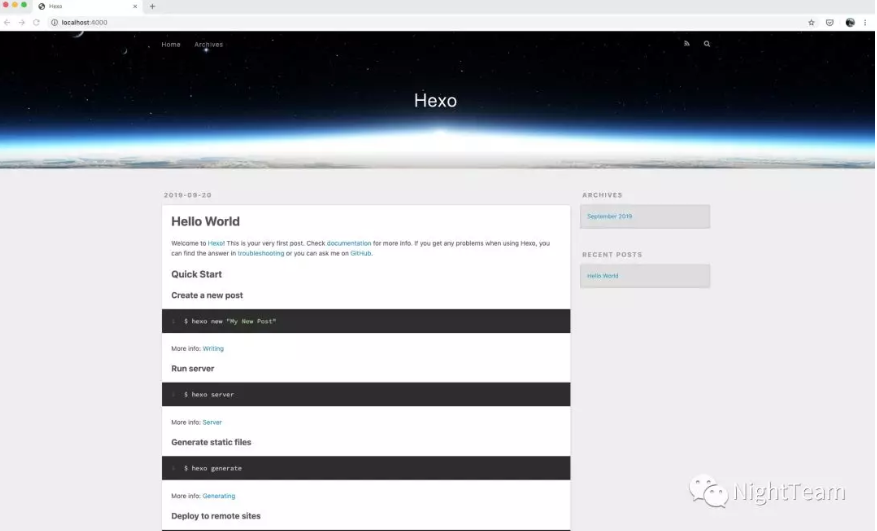

到这里，博客的雏形就完成了。之后对博客进行各种配置改动，或者发布新博文，也可以通过`hexo server`在本地运行，浏览器输入 http://localhost:4000 预览。

## 4、部署博客

这一步将初始化的博客部署到GitHub Page。

首先，打开根目录（项目的根目录即`panospanay`文件夹），用VS Code打开`_config.yml`文件，找到Deployment部分，将第一步在GitHub新建的仓库地址粘贴过来，修改如下：

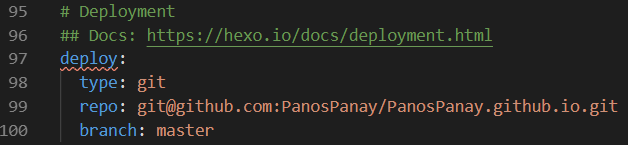

然后，额外安装一个支持 Git 的部署插件，名字叫做 hexo-deployer-git，在`panospany`文件夹下打开命令行（后面无特殊说明都在此位置运行命令行），执行如下命令：

```powershell
npm install hexo-deployer-git --save
```

安装成功后，继续执行以下部署命令：

```powershell
hexo deploy
```

执行以上命令后，命令行出现类似如下提示，说明部署成功：

```powershell
INFO  Deploying: git
INFO  Clearing .deploy_git folder...
INFO  Copying files from public folder...
INFO  Copying files from extend dirs...
On branch master
nothing to commit, working directory clean
Counting objects: 46, done.
Delta compression using up to 8 threads.
Compressing objects: 100% (36/36), done.
Writing objects: 100% (46/46), 507.66 KiB | 0 bytes/s, done.
Total 46 (delta 3), reused 0 (delta 0)
remote: Resolving deltas: 100% (3/3), done.
To git@github.com:NightTeam/nightteam.github.io.git
 * [new branch]      HEAD -> master
Branch master set up to track remote branch master from git@github.com:NightTeam/nightteam.github.io.git.
INFO  Deploy done: git
```

此时即可访问和Github Repository同名的链接来打开博客，比如我的仓库名称为`panospanay.github.io`，我访问 https://panospanay.gihub.io/ 即可打开博客，与第3步本地运行打开 http://localhost:4000 预览到的博客内容一致。

注意，在第一次打开 https://panospanay.gihub.io/ 这个链接时可能出现404，但之后重新打开就可以了，而且https和http都可以打开。

打开GitHub仓库转到master分支，可以看到Hexo上传了如下内容，实际上就是博客文件夹下面的 public 文件夹下的所有内容，Hexo 把编译之后的静态页面内容上传到 GitHub 的 master 分支上面去了。

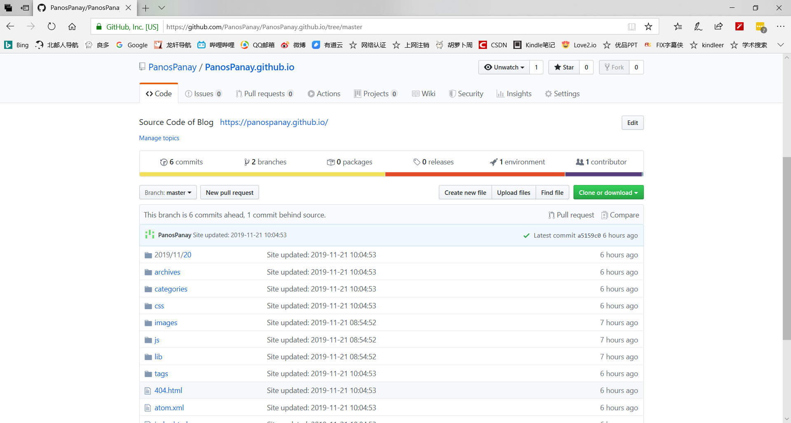

然后，通过执行如下命令，新建一个source分支，用来存储博客源码到GitHub。

```powershell
git init
git checkout -b source
git add -A
git commit -m "init blog"
git remote add origin git@github.com:{username}/{username}.github.io.git
git push origin source
```

执行成功后，可以到GitHub上切换默认分支为source，不过也可以不切换。

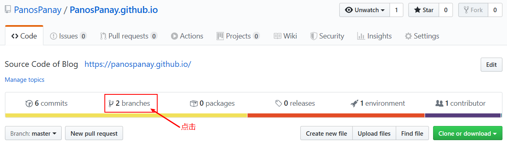

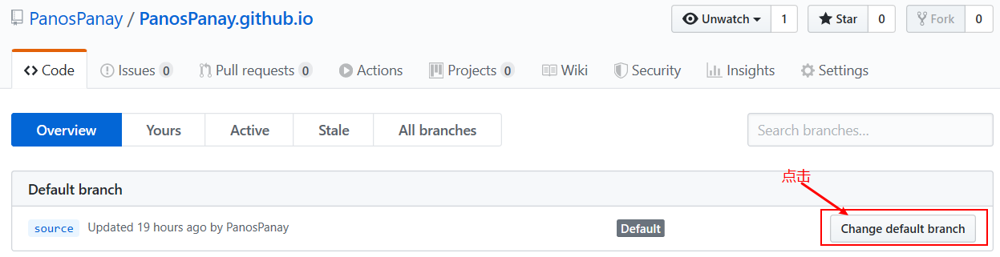

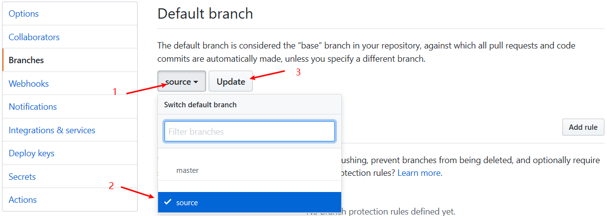

## 5、配置站点信息

这一步进行博客的基本配置，包括主题和一些其他内容。

### 5.1 修改博客站点基本配置

VS Code打开根目录（panospanay文件夹）下的 _config.yml 文件，找到 Site 区域，配置如下信息：

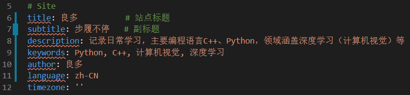

## 6、修改主题

主题配置，这里我使用的是Next主题。

首先，在themes文件夹下建立next文件夹。

在根目录下，通过命令行中执行如下命令，执行完毕后Next主题就会出现在themes/next 文件夹下。

```powershell
git clone https://github.com/theme-next/hexo-theme-next themes/next
```

然后，打开根目录下的 _config.yml 文件，找到 theme 字段，修改为 next 即可。

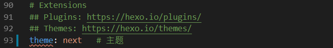

然后在命令行中执行`hexo server`开启本地服务，浏览器输入 http://localhost:4000 即可预览博客更改。

```powershell
hexo server
```

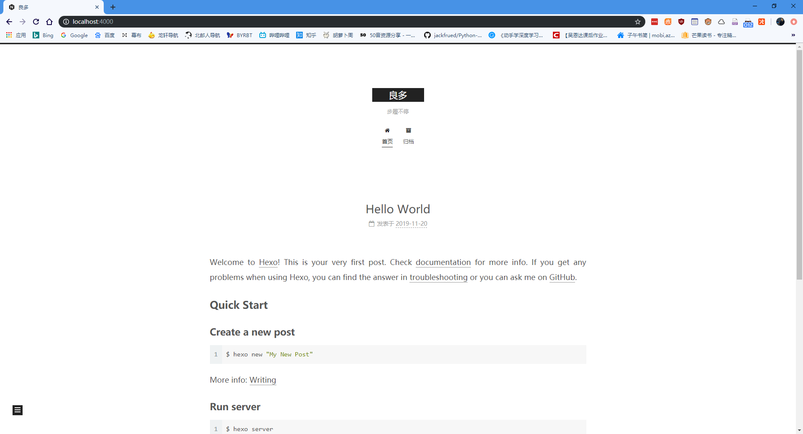

## 7、主题配置

针对Next主题，还可以进行更详细的配置。

主题配置需要修改的配置文件是 themes/next 文件夹下的 _config.yml ，用VS Code打开 themes/next/\_config.yml 文件。以下若未特别强调都是指，配置文件指的都是在这个文件。

### 7.1 样式

修改 scheme 的值可以更改布局样式。我选择的是Pisces样式。

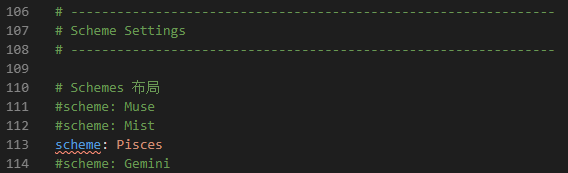

默认的Muse样式见第6步的图

Mist样式：

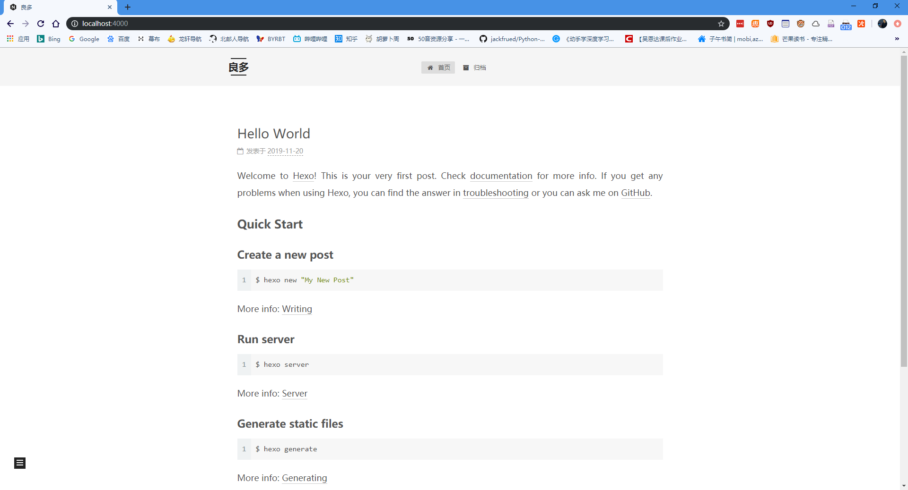

Pisces似乎和Gemini看不出区别：

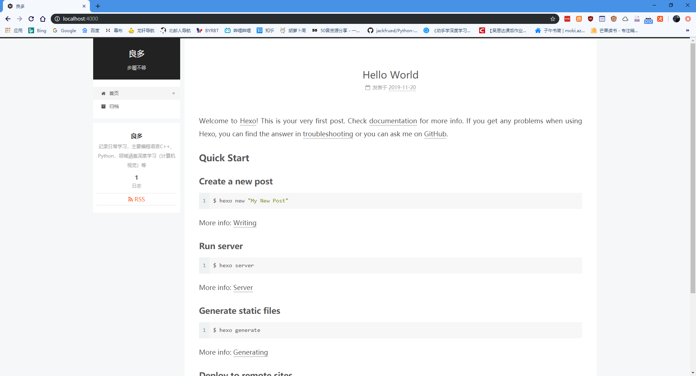

### 7.2 favicon

favicon是站点在浏览器标签栏的图标，默认是Hexo的小图标：

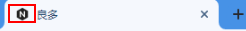

可以在网站 https://realfavicongenerator.net 上传自己的图片，进行转换，打包下载适配各种尺寸和不同设备的小图标。将这些图标拷贝到 themes/next/source/images 文件夹中。

然后在配置文件中找到 favicon 配置项，修改如下：

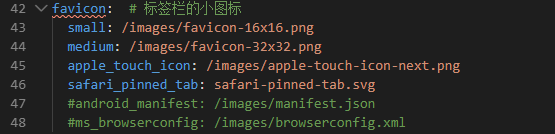

配置后战点图标如下：


### 7.3 avatar

avatar是显示在作者信息旁的头像。

将自己喜爱的头像图片 avatar.gif （也可以是其他格式的图片，eg. png）放置到 themes/next/source/images 文件夹，然后在配置文件中找到avatar配置项，修改如下：

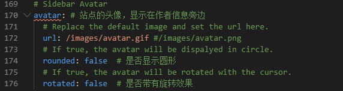

修改后效果图如下：

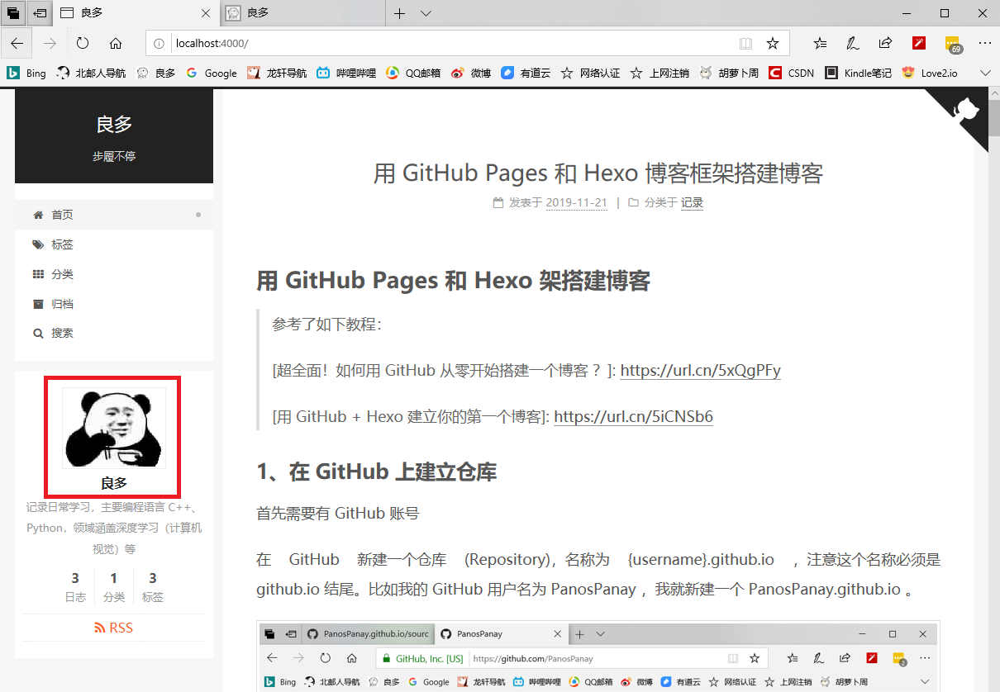

### 7.4 rss

安装 hexo-generator-feed ，可开启站点SSR订阅。在项目根目录下，即 panospanay 文件夹中打开命令行，运行如下命令。

### 7.5 code

代码块的修改，修改配置文件如下：

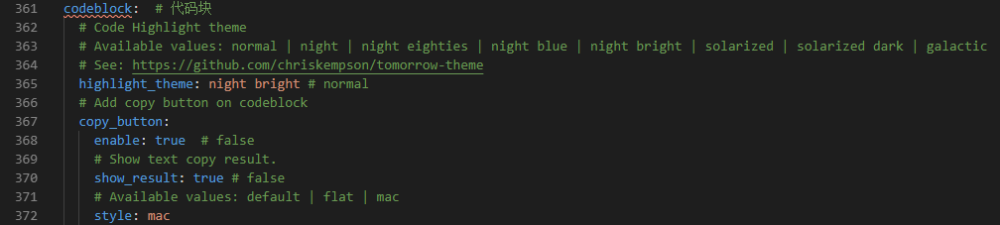

配置后效果图：

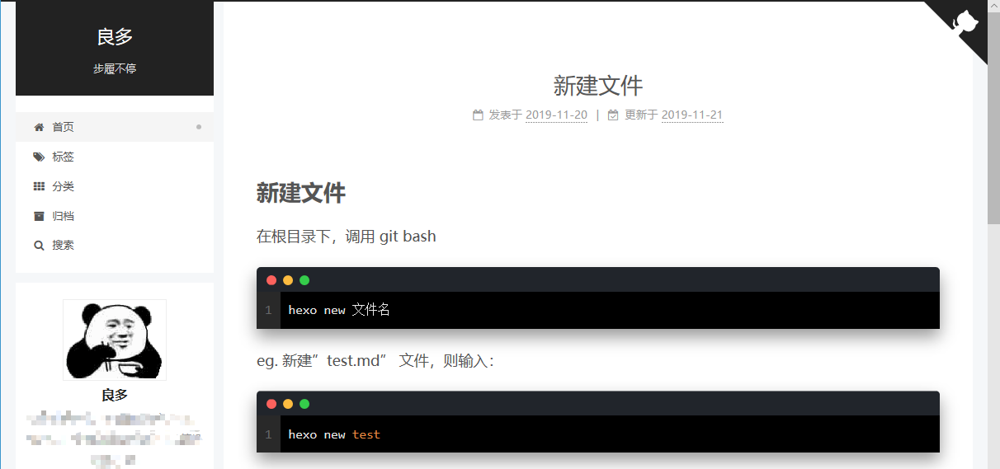

### 7.6 top

快速返回网站顶端按钮，修改配置文件如下：

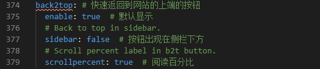

效果图：

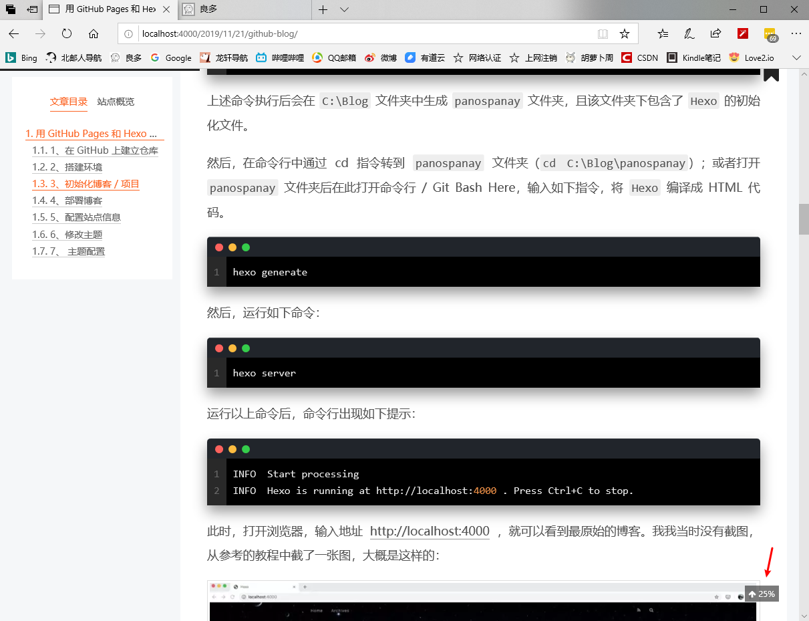

### 7.7 reading_process

阅读进度，站点顶部进度条。修改配置文件如下：

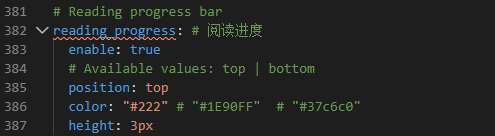

效果图：

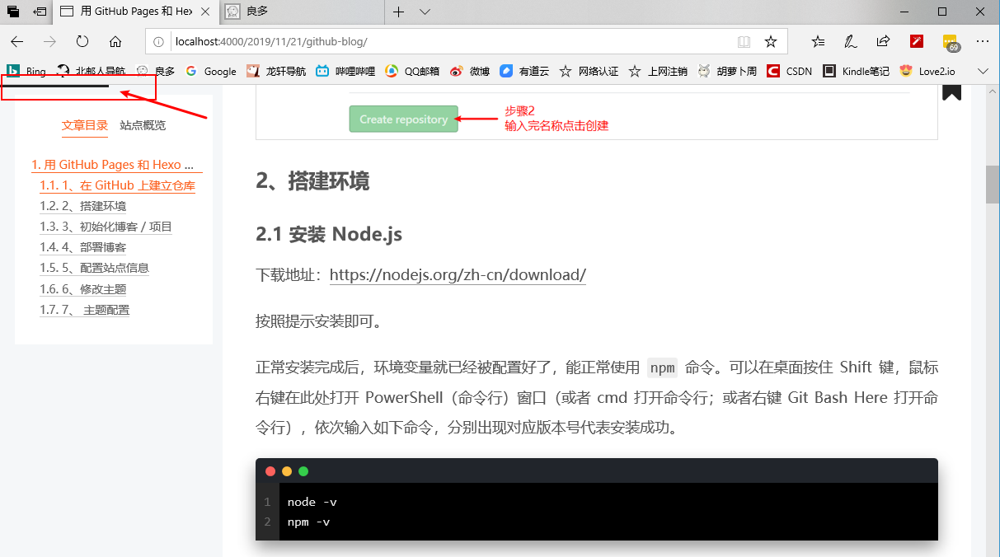

### 7.9 bookmark

书签，可以在下次打开页面的时候快速定位到上次的位置。修改配置文件如下：

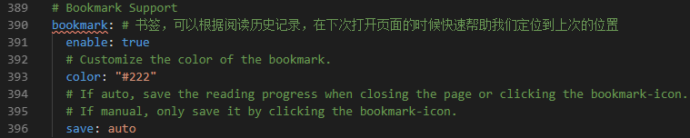

效果图：

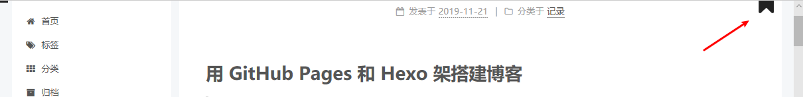

### 7.10 github_banner

在博客页面右上角显示 GitHub 图标，点击之后可以跳转到源代码页面。修改配置文件如下：

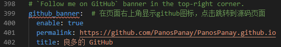

效果图：

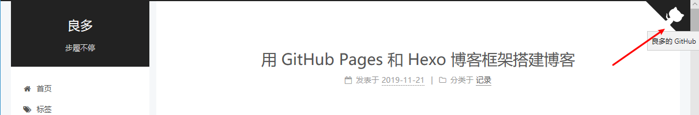

### 7.11 gittalk

第三方评论功能，gittalk利用GitHub 的 Issue 来当评论

首先，打开链接 https://github.com/settings/applications/new 注册一个 OAuth Application：

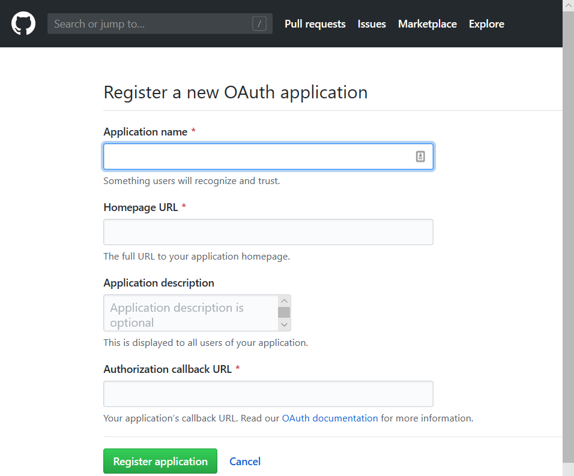

点击注册后会看到Client ID、Client Secret。

在配置文件中修改comments配置：

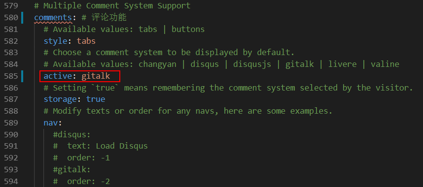

继续在配置文件中修改gittalk配置：

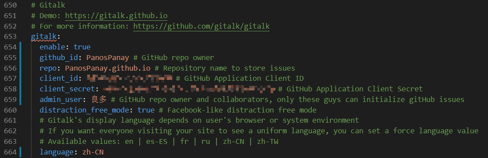

效果图（已使用GitHub授权登录）：

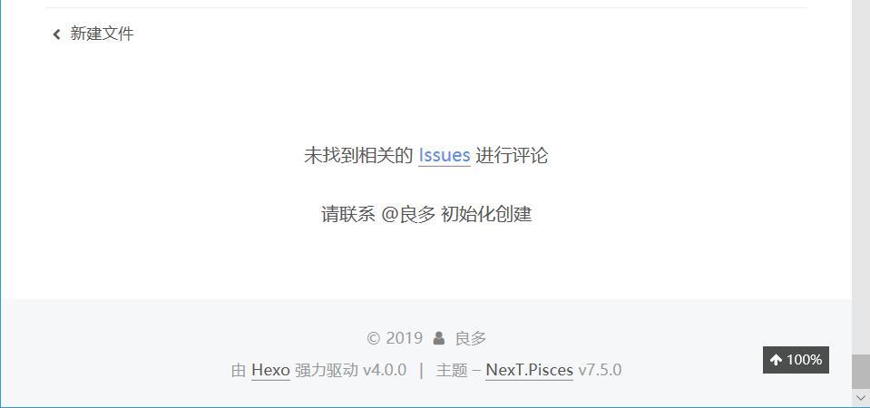

### 7.12 pangu

开启此选项，在编译生成页面的时候，中英文之间会自动添加空格，使得排版更美观。

修改配置文件如下：

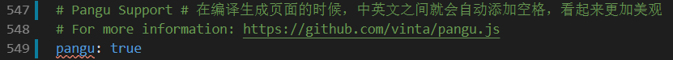

效果图：

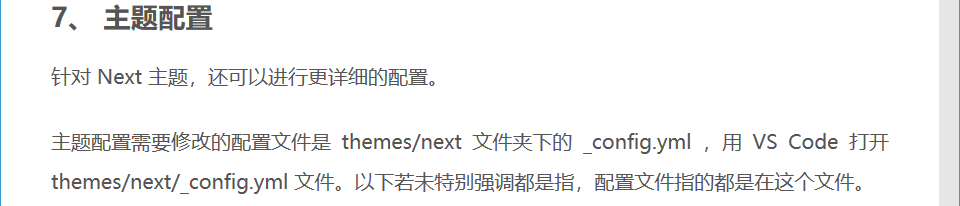

### 7.13 math

Next主题提供了两个公式渲染引擎，分别是 mathjax 和 katex，后者相对前者来说渲染速度更快，而且不需要 JavaScript 的额外支持，但后者支持的功能现在还不如前者丰富。所以这里选择的是mathjax。

修改配置文件如下：

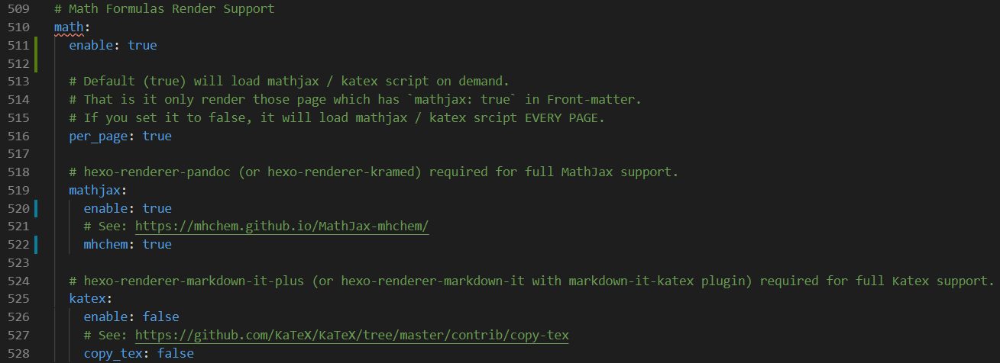

### 7.14 pjax

利用 Ajax 技术实现了局部页面刷新，既可以实现 URL 的更换，又可以做到无刷新加载。

首先，修改配置文件如下：

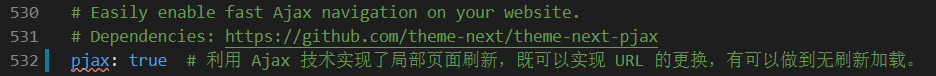

然后切换到 next 目录下，运行如下命令，安装依赖库：

```powershell
cd themes/next
git clone https://github.com/theme-next/theme-next-pjax source/lib/pjax
```

### 7.15 其他

Next主题的其他设置可以参考官方文档： https://theme-next.org/docs/

## 8、文章/博文

关于如何发布新博文，可以参考《新建文件》https://panospanay.github.io/2019/11/20/test_new/

在根目录下，调用命令行（/ Git Bash），执行如下命令：

```powershell
hexo new 文件名
```

比如，我要新建名为 "test.md" 的文章，则执行命令：

```powershell
hexo new test
```

执行后，创建的文章会出现在 `source/_posts` 文件夹下，是 MarkDown 格式。

然后，打开创建的 "test.md" 文件，在文章开头通过如下格式添加必要信息：

```markdown
---
title: 标题	# 自动创建，可修改，与文件名不同，是显示在博客上的标题
date: 日期	# 自动创建，eg.2019-11-20 23:13:18
tags:
- 标签1		# 注意'- 标签'之间的空格，漏写空格会导致博客更新不上去
- 标签2
- 标签3
categories:
- 分类1
- 分类2
---
```

然后在下方用markdown格式编辑博客即可。

### 8.1 上传图片到博客

如果博客/markdown文件中要显示图片，需要进行如下操作：

首先，在项目的配置文件（注意是博客根目录下的 _config.yml 文件）中找到 post_asset_folder 字段，修改如下：

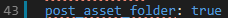

然后，在博客的根目录下执行如下指令：

```powershell
npm install https://github.com/CodeFalling/hexo-asset-image --save
```

执行上述操作后，在建立文件（`Hexo new 文件名`）时，Hexo 会自动建立一个与文章同名的文件夹，我们可以把与该文章相关的所有资源（包括图片）都放到此文件夹内，这样就可以更方便的使用资源。

验证一下，在根目录下执行以下命令：

```powershell
hexo new github-blog
```

可以看到此时source/_posts 目录下生成github-blog文件夹和github-blog.md文件：

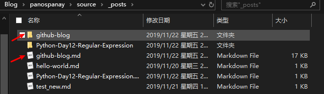

然后，将写博文所需的图片放到生成的github-blog文件夹（博文同名文件夹）下：

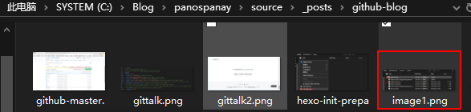

然后，在博文中用如下格式插入图片：

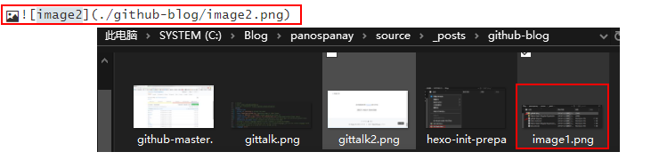

## 9、标签页和分类页

当前博客只有首页和归档，可以给博客添加标签页和分类页

### 9.1 标签页

在根目录（C:\Blog\panospanay）执行如下命令：

```powershell
hexo new page tags
```

执行命令后自动生成 source/tags/index.md 文件，内容如下：

```markdown
---
title: tags
date: 2019-11-20 23:16:47
---
```

我们可以自行添加一个 type 字段来指定页面的类型：

```markdown
type: tags
comments: false
```

然后，在主题配置文件  _config.yml 中修改menu字段，将这个页面的链接添加到主菜单里面：

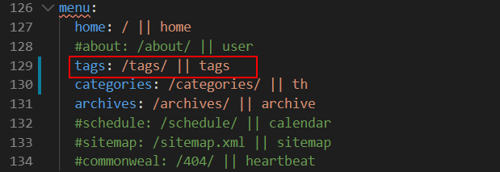

### 9.2 分类页

在根目录（C:\Blog\panospanay）执行如下命令：

```powershell
hexo new page categories
```

执行命令后自动生成 source/categories/index.md 文件，内容如下：

```markdown
---
title: categories
date: 2019-11-20 23:18:59
---
```

我们可以自行添加一个 type 字段来指定页面的类型：

```markdown
type: categories
comments: false
```

然后，在主题配置文件  _config.yml 中修改menu字段，将这个页面的链接添加到主菜单里面：

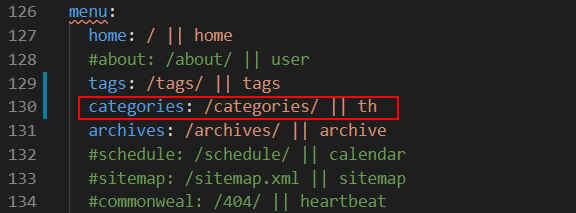

最后的效果：

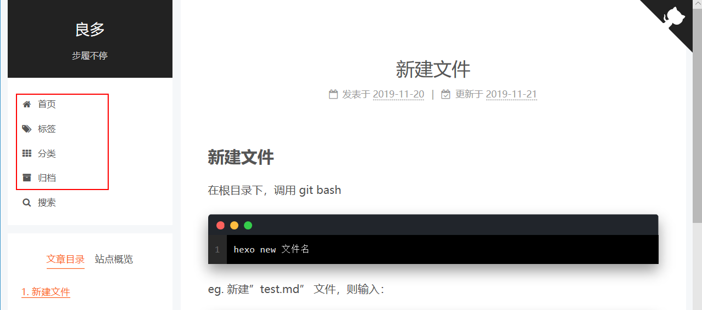

## 10、搜索页

首先，在根目录运行如下命令，安装 hexo-generator-searchdb 插件。

```powershell
npm install hexo-generator-searchdb --save
```

然后，在项目的配置文件（注意是根目录下的 _config.yml 文件），在最下面添加如下配置：

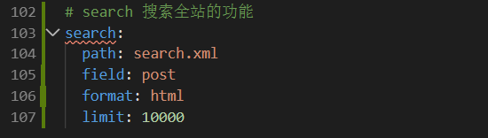

然后，在主题的配置文件（themes/next/_config.yml 文件），修改配置文件如下：

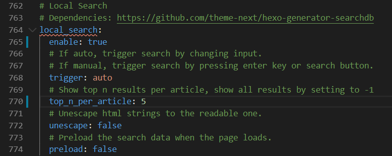

效果图如下，可以对全站的博客内容进行搜索：

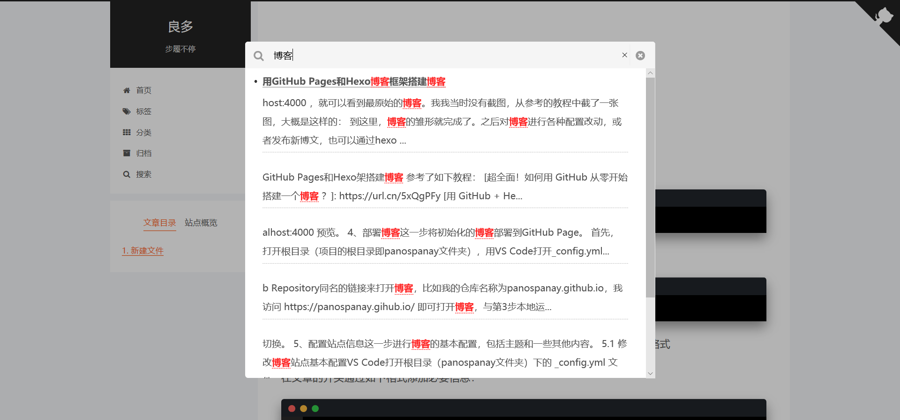

## 11、404页面

还需要添加一个 404 页面，直接在根目录的 source 文件夹中新建一个 404.md 文件即可。

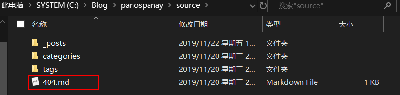

文件的内容可以参考如下：

```markdown
---
title: 404 Not Found
date: 2019-11-20 23:26:26
---

 <center> 
     对不起，您所访问的页面不存在或者已删除。
     您可以<a href="https://panospanay.github.io/">点击此处</a>返回首页。
     </center>

 <blockquote class="blockquote-center"> 
     良多
    </blockquote> 
```

## 12、 Hexo的其他配置

参考官方文档：https://hexo.io/zh-cn/docs/ 查看更多的配置。

## 12、 部署脚本

首先，在根目录下新建一个deploy.sh脚本文件，内容如下：

```sh
hexo clean
hexo generate
hexo deploy
```

然后，每次要发布的时候我们只要在根目录执行如下命令，即可完成博客的更新：

```shell
sh deploy.sh
```

至此，我们有了2种博客更新查看方式：

- 在对博客进行配置更改或者编辑修改博文时，可以在根目录执行如下指令打开本地服务器，然后浏览器打开链接 [http://localhost:4000](http://localhost:4000/) ，即可实时查看预览：

```shell
hexo server
```

- 在我们完成配置或者博文增改，确认要发布时，可以在根目录执行如下指令，即可部署发布，部署成功后，浏览器打开链接  https://panospanay.gihub.io/ 即可打开博客查看更新。不过有时候更新可能需要一段时间。

```sh
sh deploy.sh
```

## 13、 自定义域名

自定义域名是需要自己先购买域名的，因此没有购买域名的可以跳过这一步。

申请域名可以使用Freenom，网站链接 https://my.freenom.com/domains.php ，提供最多一年的免费顶级域名。

在 GitHub 的 Repository 里，找到 Settings，拉到下面，可以看到有个 GitHub Pages 的配置项，如图所示：

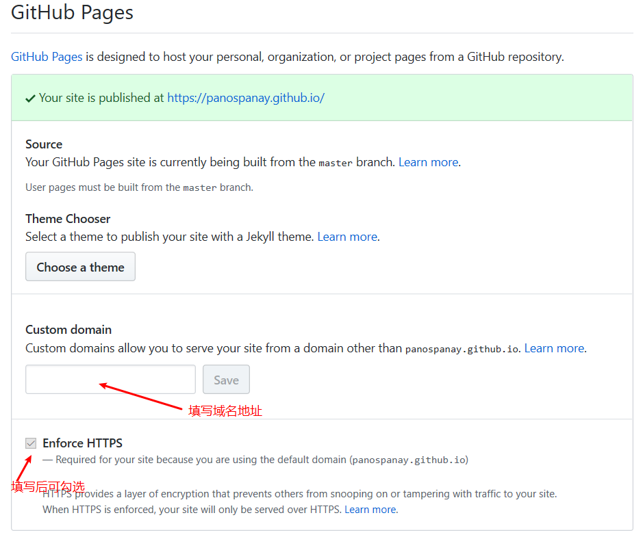

首先，填好上面的域名地址。此时上图的绿色提示部分可能出现红色报错。因为我们还没有添加CNAME解析。刚配置完自定义域名的时候可能 Enforce HTTPS 这个选项是不可用的，一段时间后等到其可以勾选了，直接勾选即可，这样整个博客就会变成 HTTPS 的协议的了。

然后，在source目录下新建一个 CNAME 文件（没有后缀），文件内容就是你的域名地址。

部署发布之后，就配置好了。

如果有未购买域名的小伙伴执行了上面的操作，发现删除了CNAME文件，清空了GitHub仓库设置里的域名地址，可是访问博客仍然会跳转到原来自定义的域名，这是因为chrome浏览器缓存问题，可换个浏览器或者过段时间再访问即可成功。