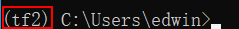
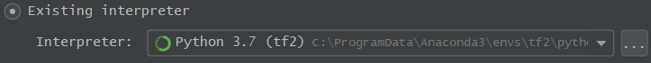
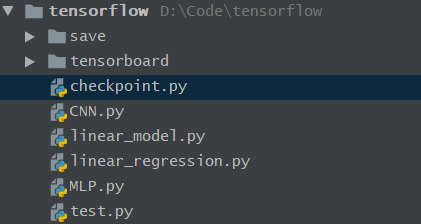

# TensorFlow

## 1、GPU版TensorFlow安装

参考：https://tf.wiki/zh/basic/installation.html

1. 安装NVIDIA 驱动程序

   访问NVDIA官网下载：https://www.nvidia.com/Download/index.aspx?lang=en-us
   
   可在cmd中输入`nvidia-smi -L`查看显卡型号，下载相应版本的驱动程序，安装后重启电脑。
   
2. 建立conda虚拟环境并进入

   打开Anaconda Prompt，输入：（python版本号填写自己的python环境版本）

   ```shell
   conda create --name tf2 python=3.7      # “tf2”是你建立的conda虚拟环境的名字
   conda activate tf2                      # 进入名为“tf2”的conda虚拟环境
   ```

   进入虚拟环境后命令行最左边或显示虚拟环境名称(tf2):

   

   （注：其他关于虚拟环境的操作如下：

   ```shell
   conda create --name [env-name]      # 建立名为[env-name]的Conda虚拟环境
   conda activate [env-name]           # 进入名为[env-name]的Conda虚拟环境
   conda deactivate                    # 退出当前的Conda虚拟环境
   conda env remove --name [env-name]  # 删除名为[env-name]的Conda虚拟环境
   conda env list                      # 列出所有Conda虚拟环境
   ```

3. 安装 CUDA Toolkit 和 cuDNN。

   ```shell
   # 注：以下两行命令中的版本号严格按照https://www.tensorflow.org/install/gpu#software_requirements 安装，
   # 对于 TensorFlow 2.1，可使用
   conda install cudatoolkit=10.1
   conda install cudnn=7.6.5
   ```

4. 安装gpu版tensorflow

   ```shell
   # pip install tensorflow-gpu # 会自动安装对应版本的 CUDA Toolkit 和 cuDNN
   pip install tensorflow	
   # 从 TensorFlow 2.1 开始，pip 包 tensorflow 即同时包含 GPU 支持
   ```

   注：从 TensorFlow 2.1 开始，pip 包 `tensorflow` 即同时包含 GPU 支持，无需通过特定的 pip 包 `tensorflow-gpu` 安装 GPU 版本。如果对 pip 包的大小敏感，可使用 `tensorflow-cpu` 包安装仅支持 CPU 的 TensorFlow 版本。

   也可以使用 `conda install tensorflow` 来安装 TensorFlow，不过 conda 源的版本往往更新较慢，难以第一时间获得最新的 TensorFlow 版本.

   安装完后，可以通过命令`pip list`查看安装的包列表

5. 检测是否正确安装

   （如果你在 Windows 下安装了 TensorFlow 2.1 正式版，可能会在导入 TensorFlow 时出现 [DLL 载入错误](https://github.com/tensorflow/tensorflow/issues/35749) 。此时安装 [Microsoft Visual C++ Redistributable for Visual Studio 2015, 2017 and 2019](https://support.microsoft.com/en-us/help/2977003/the-latest-supported-visual-c-downloads) 即可正常使用。）

   在虚拟环境中输入`python`，进入python环境，输入：

   ```python
   import tensorflow as tf
   ```

   如果报错：

   ```
   ImportError: DLL load failed: 找不到指定的模块。
   
   Failed to load the native TensorFlow runtime.
   ```

   进入https://support.microsoft.com/en-us/help/2977003/the-latest-supported-visual-c-downloads安装Visual Studio 2015, 2017 and 2019即可。

6. 第一个程序

   在虚拟环境中输入`python`，进入python环境，输入：

   ```python
   import tensorflow as tf
   
   A = tf.constant([[1, 2], [3, 4]])	
   # 运行这一行若报错cudaGetDevice() failed. Status: CUDA driver version is insufficient for CUDA runtime version
   # 跳转到第1步，安装一下NVIDIA 驱动程序即可
   
   B = tf.constant([[5, 6], [7, 8]])
   C = tf.matmul(A, B)
   
   print(C)
   ```

   输出如下结果表明安装成功

   ```python
   tf.Tensor(
   [[19 22]
   [43 50]], shape=(2, 2), dtype=int32)
   ```

7. pycharm

   新建项目，选择已存在的虚拟环境tf2

   


## 2、错误记录

### 1、` module 'tensorflow' has no attribute 'keras'`

错误详情：

我建立了一个目录如下：



然后我在该目录下新建了tensorboard.py，运行时报错`module 'tensorflow' has no attribute 'keras'`。并且去运行以上其他py文件也出现该报错，但是在建立tensorboard.py前运行都正常。

tensorboard.py开头如下：

```python
import tensorflow as td
from MLP import MLP, MNISTLoader
```

现在运行该文件夹下所有的py文件都报如标题所示错误，且都指向MLP.py文件的一行：

```python
class MLP(tf.keras.Model):
```

去网上找解决方案，基本都是：

1、更新tensorflow

2、更新keras

但我都试过了，没有用。而且，我实在`pip install tensorflow`时，自动安装的keras，因此不可能出现keras和tensorflow版本不匹配的问题。

于是，我把tensorboard.py文件删了，结果其他所有py文件都能正常运行了。

我也不知道这是为什么，不知道tensorboard.py有啥问题。改代码来自https://tf.wiki/zh/basic/tools.html#id3。只是：

```python
from zh.model.mnist.mlp import MLP
from zh.model.utils import MNISTLoader
```

修改为：

```python
from MLP import MLP, MNISTLoader
```

感觉很玄学。我就放弃了这个文件，直接删掉。然后把它的训练过程可视化代码插入到checkpoint.py中，能够正常运行。

